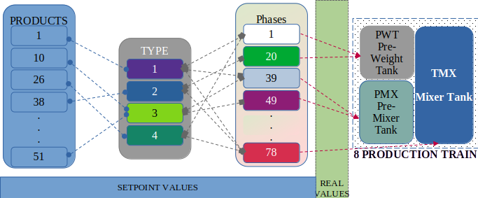

1
MEJORA DE LOS CONTROLES DE CALIDAD DE LA PRODUCCIÓN POR LOTES MEDIANTE LA PREDICCIÓN POR APRENDIZAJE AUTOMÁTICO
CASO EXTRACCION, TRANSFORMACION Y CARGA DE DATOS

(November 23)

YONILIMAN GALVIS AGUIRRE​

**RESUMEN -Los procesos de fabricación por lotes son sistemas con una variabilidad compleja y, especialmente en los procesos multiproducto, garantizar la calidad del producto requiere constantes pruebas de calidad que exigen tiempo de producción, costes de mano de obra y el uso de reactivos químicos que producen residuos que a menudo requieren un costoso tratamiento antes de que sus residuos puedan liberarse al medio ambiente.

Está más que justificado utilizar la inteligencia artificial y el aprendizaje automático para desarrollar nuevos conjuntos de herramientas que mejoren los procesos de fabricación actuales con menos costes, menos horas de mano de obra y menos impacto en el medio ambiente, aspirando a un proceso de cero residuos.**

**KEYWORDS - Aprendizaje automático; Producción por lotes; Ingeniería; Aplicación de técnicas**

1. # INTRODUCCIÓN
   La gestión de la calidad en la producción industrial por lotes es esencial para garantizar a los clientes que el producto que adquieren cumple los requisitos necesarios para desempeñar su función, al tiempo que proporciona una adecuada protección de la salud, protege activamente el medio ambiente y mantiene un precio justo.

   Actualmente el control de procesos por lotes está regulado por las normas ISA-88 y la interacción con los sistemas empresariales está regulada por las normas ISA-95, también podemos encontrar propuestas de modelado de sistemas de control distribuido para procesos por lotes basados en la norma IEC-61499 complementando el sistema para prepararlos para la implementación de sistemas abiertos para aplicaciones de inteligencia artificial y aprendizaje automático.

   En 2020 la comunidad europea presentó el informe final oficial Predictive Sensor Data mining for Product Quality Improvement (PRESED RFCS) como guía para preparar al sector de la producción de acero en la adaptación de herramientas de minería de datos e inteligencia artificial para ayudar a mejorar los procesos de producción y la calidad final del producto, esta guía puede marcar el inicio del camino a seguir para la producción por lotes.

   El creciente interés por la aplicación rápida y correcta de tecnologías innovadoras en la producción se basa en la necesidad de desarrollar sistemas de producción más limpios, reducir los costes de producción y minimizar el impacto de los productos en el medio ambiente, cumpliendo así los compromisos sociales de las empresas.

   Cuando se termina un lote de producción, es necesario tomar muestras del producto, gestionar adecuadamente estas muestras y trasladarlas a un lugar adecuado donde se puedan realizar las pruebas de laboratorio necesarias para demostrar el estado del producto, el producto y el equipo de fabricación se conservarán mientras duren las pruebas y una vez finalizadas éstas y en función de los resultados de las mismas, se tomará una decisión sobre la eliminación del producto.

   Si el producto es óptimo el producto continuará el proceso para formar el producto final presentación si el producto no es óptimo pero puede ser reprocesado para mejorar la calidad o si el producto debe ser desechado ya que no es óptimo y no hay posibilidad de mejorarlo.

   Las pruebas de laboratorio requieren la introducción de distintos tipos de muestras de productos, reactivos y material de laboratorio, así como horas de trabajo para realizar las pruebas. Al final de las pruebas, las muestras de producto contaminadas por reactivos y restos no utilizados y el equipo de laboratorio usado deben ser desinfectados. Todo este proceso genera residuos que deben eliminarse adecuadamente; añadiendo costes al producto para cubrir el tratamiento adecuado de los residuos y las horas de trabajo empleadas entre el muestreo, las pruebas de laboratorio y los sistemas de gestión de datos para registrar y garantizar la trazabilidad del producto.

   Un módulo de machine learning que sea capaz de reconocer las variables predictores de las pruebas de calidad puede predecir con antelación los resultados de laboratorio y al enfatizar aquellos que pueden ser decisivos en la liberación del producto puede lograr una disminución significativa en la frecuencia de dichas pruebas reduciéndolas a las necesarias para validar y corregir el correcto funcionamiento del módulo causará el impacto positivo deseado en la producción.

   Los resultados de la predicción también pueden ser oportunos una vez cumplidas las variables predictores y sin esperar al final del lote debería minimizar el número de lotes rechazados o insalvables.

   Todo lo anterior reducirá positivamente el impacto sobre el medio ambiente, reducirá el coste de producción, aumentará los beneficios o mejorará la competitividad del producto y permitirá que la cantidad de horas de trabajo dedicadas al control de calidad se empleen en diseñar nuevos productos o mejorar los existentes.
1. # ENTENDIENDO LOS PROCESOS
   1. ## *Tren De Produccion*
      La ANSI/ISA 88 ha sido desde los 90s la base para poder desarrollar los procesos y las piezas de software de control para la fabricación por lotes, esto ha permitido que se pueda desarrollar procesos estandarizados y que comparten similitudes profundas sin depender de que producto se fabrique, el país donde se ubique la empresa o de la disparidad en los equipos industriales ó los conceptos empresariales propios de la industria.

      Más allá de esto una ventaja muy importante es la forma de organización de los registros obtenidos del proceso los cuales al tener la necesidad de cumplir con el estándar internacional de la ISA 88 van a compartir conceptos, grupos de variables y divisiones, esto es un campo fértil para la implementación de sistemas IA que puedan ayudar a la producción y que puedan ser escalables y se puedan propagar de forma apropiada a todas las industrias.

      Para entender este papel es necesario entender el concepto de tren de producción o Unidad, es según el estándar el Conjunto de equipos de procesamiento y control necesarios para desarrollar actividades mayores de proceso. Operan relativamente independientes unas de otras.

      **Imagen 1: Tren de Producción**

      ||
      | :-: |

      ||

      Image source: https://www.x-mol.net/paper/article/5795495

      En resumen el tren es el conjunto de equipos necesarios para poder fabricar un lote de producto de forma total e independiente (pueden haber equipos compartidos pero estos sólo trabajan para fabricar un lote a la vez), tal como: tanques, motores, bombas, válvulas, tramos de tubería, sensores, transmisores, básculas, tolvas, intercambiadores de calor, etc.

   1. ## *Explicacion De Los Datos De Proceso*
Los datos usados en este paper corresponden a 14876 lotes producidos por 8 trenes de producción (A,B,C,D,E;F,G,H), los cuales pueden producir 4 familias de producto y de los cuales existen 78 variantes de producto, durante 516 dias (12399 horas).

| **Columns** | **Details**                                                                 | **Total** |
|-------------|-----------------------------------------------------------------------------|-----------|
| Datetime    | Datetime of production start                                                | 516 days  |
| ID          | Register ID                                                                 | 14876     |
| Prod        | Identification of manufactured products                                     | 51        |
| Type        | Product Family group                                                        | 4         |
| Train       | Manufacturing Batch Reactor and devices instances group                     | 8         |
| Unit        | Unit of process used                                                        | 3         |
| Phase_ID    | Components and Phases                                                       | 78        |
| EU          | Engineering units                                                           | 7         |
| Value       | Value as a percentage with respect to the adjusted value of the real value  |           |
|             | (additions, wait times, speeds, temperatures, pressures, etc.)              |           |
| Check       | Regular pH verification (yes or no?)                                        |           |
| Total       | All transactions logged in CSV                                              | 236530    |

**Tabla 1: Descripcion de DataSet**

Los datos usados en este paper corresponden a 14876 lotes producidos por 8 trenes de producción (A,B,C,D,E;F,G,H), los cuales pueden producir 4 familias de producto y de los cuales existen 78 variantes de producto, durante 516 dias (12399 horas).

Se registra la información de produccion durante 516 dias para los 8 trenes, durante ese tiempo se registraron por fecha 14876 lotes de 4 tipos de producto diferentes, para producir se necesita seguir una formula de fabricación y estas formulas indican el paso a paso de la fabricacion (fases), estado y secuencia de actividad variables y equipos desde adiciones y cantidades de las materias primas, el valor de ajuste de temperatura, presión, velocidades, tiempos de emulsificación, valores de PH, etc., estos corresponden a 78 predictores y la cantidad de la variable respectiva se ajustan al porcentaje con respecto al valor de ajuste, por esto si son menores a 1 significan que el nivel de cumplimiento es bajo y si son mayores que 1 significa que sobrepasaron el valor de consigna, ambas condiciones causan inestabilidad del proceso.

EL CSV corresponde a los valores guardados de forma secuencial por tanto existen 236530 filas, tenga en cuenta que la cantidad de fases depende del tipo de producto, adicionalmente, un tren esta compuesto por 3 elementos principales (de transformacion de materias prima), un tanque de prepesada donde se adicionan cantidades pequeñas medidas por bascula para mejorar la presicion, tanque de premezclado, esto permite realizar tareas simultaneas con el tanque mezclador principal y reducir el tiempo de lote y el tanque Mezclador el cual es el tanque principal donde llegan todos los materiales para el proceso de transformacion final, adicionalmente se adicionan los productos de mayor cantidad y aquellos que se inyectan usando medidores / contadores por flujo y las descargas de las unidades mas pequeñas.

