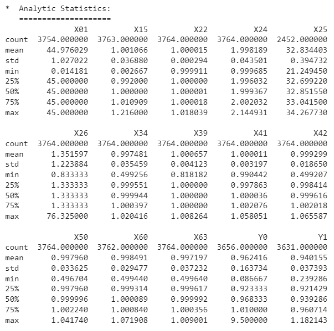

1
MEJORA DE LOS CONTROLES DE CALIDAD DE LA PRODUCCIÓN POR LOTES MEDIANTE LA PREDICCIÓN POR APRENDIZAJE AUTOMÁTICO
CASO EXTRACCION, TRANSFORMACION Y CARGA DE DATOS

(November 23)

YONILIMAN GALVIS AGUIRRE​

**RESUMEN -Los procesos de fabricación por lotes son sistemas con una variabilidad compleja y, especialmente en los procesos multiproducto, garantizar la calidad del producto requiere constantes pruebas de calidad que exigen tiempo de producción, costes de mano de obra y el uso de reactivos químicos que producen residuos que a menudo requieren un costoso tratamiento antes de que sus residuos puedan liberarse al medio ambiente.

Está más que justificado utilizar la inteligencia artificial y el aprendizaje automático para desarrollar nuevos conjuntos de herramientas que mejoren los procesos de fabricación actuales con menos costes, menos horas de mano de obra y menos impacto en el medio ambiente, aspirando a un proceso de cero residuos.**

**KEYWORDS - Aprendizaje automático; Producción por lotes; Ingeniería; Aplicación de técnicas**

1. # INTRODUCCIÓN
   La gestión de la calidad en la producción industrial por lotes es esencial para garantizar a los clientes que el producto que adquieren cumple los requisitos necesarios para desempeñar su función, al tiempo que proporciona una adecuada protección de la salud, protege activamente el medio ambiente y mantiene un precio justo.

   Actualmente el control de procesos por lotes está regulado por las normas ISA-88 y la interacción con los sistemas empresariales está regulada por las normas ISA-95, también podemos encontrar propuestas de modelado de sistemas de control distribuido para procesos por lotes basados en la norma IEC-61499 complementando el sistema para prepararlos para la implementación de sistemas abiertos para aplicaciones de inteligencia artificial y aprendizaje automático.

   En 2020 la comunidad europea presentó el informe final oficial Predictive Sensor Data mining for Product Quality Improvement (PRESED RFCS) como guía para preparar al sector de la producción de acero en la adaptación de herramientas de minería de datos e inteligencia artificial para ayudar a mejorar los procesos de producción y la calidad final del producto, esta guía puede marcar el inicio del camino a seguir para la producción por lotes.

   El creciente interés por la aplicación rápida y correcta de tecnologías innovadoras en la producción se basa en la necesidad de desarrollar sistemas de producción más limpios, reducir los costes de producción y minimizar el impacto de los productos en el medio ambiente, cumpliendo así los compromisos sociales de las empresas.

   Cuando se termina un lote de producción, es necesario tomar muestras del producto, gestionar adecuadamente estas muestras y trasladarlas a un lugar adecuado donde se puedan realizar las pruebas de laboratorio necesarias para demostrar el estado del producto, el producto y el equipo de fabricación se conservarán mientras duren las pruebas y una vez finalizadas éstas y en función de los resultados de las mismas, se tomará una decisión sobre la eliminación del producto.

   Si el producto es óptimo el producto continuará el proceso para formar el producto final presentación si el producto no es óptimo pero puede ser reprocesado para mejorar la calidad o si el producto debe ser desechado ya que no es óptimo y no hay posibilidad de mejorarlo.

   Las pruebas de laboratorio requieren la introducción de distintos tipos de muestras de productos, reactivos y material de laboratorio, así como horas de trabajo para realizar las pruebas. Al final de las pruebas, las muestras de producto contaminadas por reactivos y restos no utilizados y el equipo de laboratorio usado deben ser desinfectados. Todo este proceso genera residuos que deben eliminarse adecuadamente; añadiendo costes al producto para cubrir el tratamiento adecuado de los residuos y las horas de trabajo empleadas entre el muestreo, las pruebas de laboratorio y los sistemas de gestión de datos para registrar y garantizar la trazabilidad del producto.

   Un módulo de machine learning que sea capaz de reconocer las variables predictores de las pruebas de calidad puede predecir con antelación los resultados de laboratorio y al enfatizar aquellos que pueden ser decisivos en la liberación del producto puede lograr una disminución significativa en la frecuencia de dichas pruebas reduciéndolas a las necesarias para validar y corregir el correcto funcionamiento del módulo causará el impacto positivo deseado en la producción.

   Los resultados de la predicción también pueden ser oportunos una vez cumplidas las variables predictores y sin esperar al final del lote debería minimizar el número de lotes rechazados o insalvables.

   Todo lo anterior reducirá positivamente el impacto sobre el medio ambiente, reducirá el coste de producción, aumentará los beneficios o mejorará la competitividad del producto y permitirá que la cantidad de horas de trabajo dedicadas al control de calidad se empleen en diseñar nuevos productos o mejorar los existentes.
1. # ENTENDIENDO LOS PROCESOS
   1. ## *Tren De Produccion*
      La ANSI/ISA 88 ha sido desde los 90s la base para poder desarrollar los procesos y las piezas de software de control para la fabricación por lotes, esto ha permitido que se pueda desarrollar procesos estandarizados y que comparten similitudes profundas sin depender de que producto se fabrique, el país donde se ubique la empresa o de la disparidad en los equipos industriales ó los conceptos empresariales propios de la industria.

      Más allá de esto una ventaja muy importante es la forma de organización de los registros obtenidos del proceso los cuales al tener la necesidad de cumplir con el estándar internacional de la ISA 88 van a compartir conceptos, grupos de variables y divisiones, esto es un campo fértil para la implementación de sistemas IA que puedan ayudar a la producción y que puedan ser escalables y se puedan propagar de forma apropiada a todas las industrias.

      Para entender este papel es necesario entender el concepto de tren de producción o Unidad, es según el estándar el Conjunto de equipos de procesamiento y control necesarios para desarrollar actividades mayores de proceso. Operan relativamente independientes unas de otras.

      **Imagen 1: Tren de Producción**

      ||
      | :-: |

      Image source: https://www.x-mol.net/paper/article/5795495

      En resumen el tren es el conjunto de equipos necesarios para poder fabricar un lote de producto de forma total e independiente (pueden haber equipos compartidos pero estos sólo trabajan para fabricar un lote a la vez), tal como: tanques, motores, bombas, válvulas, tramos de tubería, sensores, transmisores, básculas, tolvas, intercambiadores de calor, etc.
   1. ## *Explicacion De Los Datos De Proceso*
Los datos usados en este paper corresponden a 14876 lotes producidos por 8 trenes de producción (A,B,C,D,E;F,G,H), los cuales pueden producir 4 familias de producto y de los cuales existen 78 variantes de producto, durante 516 dias (12399 horas).

| **Columns** | **Details**                                                                 | **Total** |
|-------------|-----------------------------------------------------------------------------|-----------|
| Datetime    | Datetime of production start                                                | 516 days  |
| ID          | Register ID                                                                 | 14876     |
| Prod        | Identification of manufactured products                                     | 51        |
| Type        | Product Family group                                                        | 4         |
| Train       | Manufacturing Batch Reactor and devices instances group                     | 8         |
| Unit        | Unit of process used                                                        | 3         |
| Phase_ID    | Components and Phases                                                       | 78        |
| EU          | Engineering units                                                           | 7         |
| Value       | Value as a percentage with respect to the adjusted value of the real value  |           |
|             | (additions, wait times, speeds, temperatures, pressures, etc.)              |           |
| Check       | Regular pH verification (yes or no?)                                        |           |
| Total       | All transactions logged in CSV                                              | 236530    |

**Tabla 1: Descripcion de DataSet**

Los predictores (X01 a X33) son las variables medidas del proceso, fases de adición/agitación/tiempo ó velocidades, dados como valores que corresponden al porcentaje de cumplimiento:

**Equation 1: Predictores**

X=Predictor=%Cumplimiento =Valor RealValor Objetivo

Los valores de salida del sistema ‘Y’ corresponden a 3 pruebas de calidad realizadas al producto y que son factores para liberar o retener el producto: ‘PH’, ’Viscosidad’, ’Ingrediente crítico’.
1. ## *Análisis Exploratorio De Los Datos.*
Conocer los datos es muy importante para comprender el comportamiento del modelo ya que refleja el comportamiento del proceso de producción y nos permite colocar el foco de atención de forma adecuada para generar un impacto más positivo usando una cantidad de recursos más razonable.

Hay que tener en cuenta que es fácil desear hacer un módulo de machine learning capaz de satisfacer todas las necesidades, pero esto puede ser un reto innecesario ya que puede ser que el impacto en la producción sea mínimo, la cantidad de datos sea insuficiente para tener un buen comportamiento y/o el uso de recursos de programación y/o ejecución sea demasiado elevado para el posible resultado obtenido.

Lo más importante es conocer los datos e identificar el foco, cuando los datos salen de la base de datos no se puede observar claramente el foco y el deseo de los usuarios puede sobrepasar a las capacidades de cualquier sistema porque tendemos a sobreestimar a la inteligencia artificial y pensar en que la IA puede hacer cosas que ni un ser humano con conocimientos extraordinarios pudiera hacer.
1. ## *Observaciones De Todos Los Datos:*
   Crear Gráficos e histogramas es fundamental para entender los datos:

   **Imagen 2: Cantidad de Lotes producidos por cada tren por tipo de producto**

   |![ref1]|
   | :-: |
   |![ref2]|

   **Imagen 3: Cantidad de Lotes producidos por producto y Tipo**

   ||
   | :-: |
   ||
   ||
   ||

   **Imagen 4: Pastel de Familias de Productos**

   ||
   | :-: |

   Aunque las gráficas dicen mucho, crear reportes de texto también ayuda a focalizarse de forma correcta para evitar usar recursos buscando resultados unicornios:

<table>   <tr><th colspan="2"></th></tr>
   <tr><td colspan="2"></td></tr>
   <tr><td colspan="2"></td></tr>
   <tr><td colspan="1" rowspan="2"></td><td colspan="1"></td></tr>
   <tr><td colspan="1"></td></tr>
</table>
   **Tabla 2: Análisis numérico  de producto por cantidades**

   Observando las gráficas y las tablas presentadas podemos evidenciar que:

1. La familia de productos tipo ‘S’ es la más producida con una proporción de 85.4% de los registros. (5671 lotes)
1. La segunda familia de productos más producidos es la tipo ‘F’ con el 14.3% (948 lotes).
1. No hay suficientes registros de la familia de productos  ‘X, B’.
1. La prueba de calidad Y0 sólo es realizada para productos del grupo tipo ‘S’.
1. La prueba de calidad ‘Y1’ es usada en todos los productos.
1. La prueba de calidad tipo ‘Y2’ no se realiza en el grupo de productos tipo ‘S’.

Basados en las observaciones anteriormente detalladas podemos hacer una primera conclusión:

|
La familia de productos críticos es el ‘S’ ya que es el grupo de más alta producción y nos ofrece una cantidad de datos mayor y la oportunidad de realizar en vivo un mayor número de pruebas, ajustes en el menor tiempo posible.

Si el módulo de ML desarrollado tiene resultados óptimos el impacto y beneficios serán maximizados si está enfocado al producto tipo ‘S’, esto reduce las dimensiones de los predictores y simplifica el modelo de ML.

Por tanto la salida del modelo propuesta como ‘Y2’, la que representa una prueba de calidad propuesta al inicio del papel queda descartada ya que esta no se realiza para la familia de productos tipo ‘S’
|
| - |

**Hito 1: Selección de grupo de producto**
1. ## *Observaciones De La Familia De Productos Tipo ‘S’*
   Identificamos los productos de la familia ‘S’, las cantidades de los mismos y el porcentaje de participación:

   ||
   | :- |

   **Tabla 3: Productos de la familia 'S'**

   **Imagen 5: Pastel de Productos del tipo 'S'**

   ||
   | :-: |

   Ahora observando los registros de la familia tipo ‘S’ podemos observar que el 66.4% de los registros (3764) corresponden al producto tipo P01, además hay pocos registros en los productos de los tipos restantes, esto permite focalizar el desarrollo a un producto específico y reducir dimensiones, reducir problemas de sesgo de datos en el entrenamiento del Perceptrón y mejorar el comportamiento del modelo el ML propuesto.

   |El modelo se debe de Focalizar en el Producto P01 el cual pertenece a la familia de productos ‘S’|
   | - |

   **Hito 2: Selección de tipo de producto**
1. ## *Observación De Los Datos Del Producto ‘P01’*
   Claramente se ha establecido un objetivo realista en el módulo de ML objetivo de este papel, pero basados en las evidencias observadas en el comportamiento de los propios registros obtenidos para este estudio.

   ||
   | - |
   ||

   **Tabla 4: Estadística Descriptiva Producto 'P01'**

   Ahora es importante centrarse en la limpieza de los datos para que el Perceptrón no produzca fallas en el aprendizaje.

1. ## *Búsqueda De Valores Faltantes*
   En los registros industriales se pueden generar eventualmente valores nulos, estos pueden ser producidos por:

- Cambios de formulación y/o materias primas.
- Re conexionado y/o fallas en la transmisión de los equipos de medida.
- Pérdida de registros por Lags de rendimiento en los servidores que causan fallas  en la escritura de los registros en las bases de datos. (los lags de rendimiento tiene diferentes causas tal como ejecuciones prolongadas de sistemas antivirus, backups de bases de la datos, actualización de sistema operativo, fallas de configuración de los sistemas de ciber seguridad, etc.)
- Problema en las redes de comunicaciones.

Siempre es necesario realizar el proceso de identificar datos faltante, valores nulos ó NaNs (Not available Numbers).

**Imagen 6: Grafica de Seaborn de Datos Faltantes**

||
| :-: |

||
| :-: |

**Tabla 5: Conteo de Valores Faltantes**

Es importante determinar qué hacer con los datos faltantes, las opciones son:

- Eliminar la columna o fila.
- Asumir y Completar con valor 0.
- Asumir y Completar con el promedio de la columna.
- Asumir y Completar con el valor de la media.
- Asumir y Completar con el valor moda de la columna.

Al momento de decidir es necesario comprender que es mejor o peor para el modelo teniendo en cuenta:

La cantidad de datos disponibles ya que si tenemos suficientes eliminar estos datos es una opción mejor, pero si son insuficientes tendrán que asumir el valor y completarlo.

También es importante tener en cuenta el impacto del valor en el comportamiento del modelo porque si es un predictor crítico no se puede eliminar, pero por ejemplo si es un valor en el conjunto de valores usados para entrenar (salidas), asumir el valor no va a ayudar en el modelo y por el contrario puede desmejorar el desempeño del sistema.

|
- Salidas: 

- Las filas correspondientes a datos perdidos de las salidas serán eliminados [‘Y0’, ‘Y1’]

- Las filas donde las dos salidas [‘Y0’, ‘Y1’] sean cero al tiempo serán eliminadas.

- Predictores:

- La columna X25 tiene aproximadamente un 40% de valores perdidos, el conjunto de datos tiene 14 predictores con 3765 registros, por tanto se decide prescindir de este predictor ya que hay suficientes datos.

- Las filas con datos perdidos de las columnas [‘X01’,’X15’,’X60’] serán eliminadas ya que la suma total de ellas no es representativo en los datos.
|
| - |

**Hito 3: Arreglar Datos perdidos**

**Imagen 7: Grafica de datos perdidos después del procesamiento**

|||
| :- | :- |
1. ## *Codificación De Columnas Categóricas*
   Ya los datos han sido segmentados para focalizarse en el producto ‘P01’ el cual pertenece a la familia ‘S’, así que las columnas categóricas de referencia de producto [‘Prod\_ref’, ‘Type’) no son necesarias para el modelo pero la pregunta a responder es:

   ¿Puede la diferencia en el tren de producción tener una correlación en los resultados de las pruebas de calidad?

   La respuesta no es tan obvia pero si colocamos lógica nos damos cuenta que si, ya que los equipos son diferentes, la válvula de adición de una materia prima X no es la misma en cada tren y por tanto cada equipo tendrá cambios en su comportamiento debido a condiciones variantes como presión de aire, fugas de producto, cavitación, marca, ataque químico, materiales de construcción e incluso condiciones de montaje que afectan el comportamiento de cada equipo, por tanto es necesario tomar el tren como un predictor

   La identificación de equipos es un valor tipo carácter desde [‘A’] hasta [‘H’], este debe ser transformado para que pueda ser usado en un Perceptrón, así que se debe se transformará en 8 columnas cada una para una clase con valores **enteros** 0 y 1 para identificar el equipo que realizó la fabricación.

   |||
   | :-: | :-: |

   **Tabla 6: Columnas categóricas**
1. ## *Normalización De Datos*
   Para eliminar la disparidad en los rangos de valores entre predictores se realiza una normalización usando la escalización usando mínimo y máximo para mejorar el desempeño de la predicción en la red neuronal.
1. ## *Depuración De Columnas.*
   Se encuentra que el dataset no tiene columnas de alta correlación, baja variabilidad.

   Se buscan para eliminar las filas cuyos valores sean cero por más del 90% de los registros

   Se buscan y no se encuentran filas de registros los cuales no posean ninguna prueba (Y0 + Y1 = 0)

   Se hace necesario depurar columnas predictores tomando en cuenta factores como:

- Número excesivo de variables (Columnas Predictores)
- Alta correlación entre columnas.
- Varianza excesiva de variables (Columnas Predictores)	de variables (Columnas Predictores)
- Variables predictores constantes o con varianza cercana a cero.
- Columnas con una correlación contra las salidas cercana a cero.

|
- Se decide NO usar Reducción de dimensiones PCA debido a: 

- No se encuentra correlación entre predictores.

- La cantidad de predictores es adecuada y no afecta el tiempo de entrenamiento.

- Los predictores no tienen valores de varianza en rangos muy altos

- El Conjunto de datos se puede entender fácilmente y por tanto no necesita una reducción para graficarlos con el fin de entenderlos.
|
| - |

**Hito 4: Reducción de Dimensiones**
1. ## *Correlación entre De Columnas.*
   **Imagen 8: Gráfica de correlación**

   ||
   | - |

   **Imagen 9: Mapa de Calor de Correlación**

   ||
   | - |

   Las columnas tienen entre si un índice de correlación bajo por tanto se decide conservar todos los predictores para entrenar la red neuronal.
1. ## *Programación orientada a objetos*
   Python es un lenguaje de programación orientada a objetos, esta característica permite una flexibilidad en la programación, Utilizar esta característica y crear objetos plantilla ó objetos clase ayuda a disminuir el tiempo de ejecución en los productos finales ya que se puede reusar código y/o activar y desactivar parte del mismo en tiempo de ejecución.

   Siguiendo el modelo propuesto por [1], creamos una plantilla u objeto clase para nuestro modelo y en este definimos una función de entrada la cual tenga los híper-parámetros necesarios para el funcionamiento del modelo.

   **Imagen 10: Clase DLM**

   ||
   | - |
1. ## *Modelo Dinámico Lineal con Aprendizaje profundo supervisado. (DLM - DML)*
   Debido a que el modelo posee a 2 salidas Se decidió usar un modelo de red neuronal profunda, el dataset ya limpio llega con 3511 filas y 22 columnas.

   En la industria es positivo usar unos modelos de Machine Learnig que sean capaces de entender la secuencialidad de los datos ya que como lo mencionamos antes, los registros dependen de otras variables físicas no medidas como desgastes, operaciones manuales, diferencia de las características fisicoquímicas de las materias primas, efectos del calentamiento (o exceso de frio en países con cambios de estación) en los equipos, fugas, goteos, cavitaciones, etc.

   Debido a esta razón el modelo dinámico lineal permite tomar en cuenta esta característica de los datos y junto a sistemas estocásticos dan un excelente rendimiento para tratar datos industriales.
1. ## *División de Datos*
   La división de los datos del X y Y es importante para el desempeño de la red neuronal, una de las mejores opciones es usar KFold donde pede dividir en varios grupos de entrenamiento y de test para evitar que el Perceptrón se sobre entrene
1. ## *Perceptrón*
   En este caso usamos un código que permite que se generen las capas densas del Perceptrón de forma dinámica y utilizar un arreglo para configurar las capas densas, se utiliza también dropout para mejorar el desempeño del aprendizaje, se usa una entrada de 20 neuronas por los 20 descriptores de entrada, una capa densa de 10 neuronas y dos más con 2 neuronas.

   **Imagen 11: Reporte Division Kfold**

   ||
   | :-: |

   **Imagen 12: Estructura Perceptrón**

   ||
   | :-: |

   **Imagen 13: Grafica de Loss**

   ||
   | :-: |

   **Imagen 14: Gráfica de Error Absoluto Medio**

   ||
   | :-: |

   **Imagen 15: MSE\_nn, MAE\_nn**

   ||
   | :- |

1. # Bibliography

|[1] |P. Mooring, "Predicción de valores con Deep Learning y Keras," 22 01 2022. [Online]. Available: https://www.peterspython.com/es/blog/prediccion-de-valores-con-deep-learning-y-keras. [Accessed 18 11 2023].|
| :- | :- |
|[2] |j. Brownlee, "How to Use the ColumnTransformer for Data Preparation," 31 12 2020. [Online]. Available: https://machinelearningmastery.com/columntransformer-for-numerical-and-categorical-data/. [Accessed 01 11 2023].|
|[3] |T. J. Fan, "VOTE SLEP018 - Pandas Output for Transformers," 17 07 2022. [Online]. Available: https://github.com/scikit-learn/enhancement_proposals/pull/72. [Accessed 01 11 2023].|
|[4] |T. J. Fan, A. Mueller and J. V. den Bossche, "ColumnTransformer & Pipeline Simplified," [Online]. Available: https://github.com/scikit-learn/scikit-learn/blob/main/sklearn/compose/_column_transformer.py. [Accessed 01 11 2023].|
|[5] |D. Davis, "Selección automática de características en Python: una guía esencial," 19 07 2021. [Online]. Available: https://hackernoon.com/es/seleccion-automatica-de-caracteristicas-en-python-una-guia-esencial-uv3e37mk. [Accessed 01 11 2023].|
|[6] |elmundodelosdatos.com, "Identificación e imputación de valores perdidos en Python," 05 06 2021. [Online]. Available: https://elmundodelosdatos.com/identificacion-valores-perdidos-python/. [Accessed 01 11 2023].|
|[7] |J. Brownlee, "Dropout Regularization in Deep Learning Models with Keras," 08 06 2022. [Online]. Available: https://machinelearningmastery.com/dropout-regularization-deep-learning-models-keras/. [Accessed 01 11 2023].|
|[8] |R. Vaquerizo, "Modelos lineales dinámicos (DLM) con R," 07 09 2014. [Online]. Available: https://analisisydecision.es/modelos-lineales-dinamicos-dlm-con-r/. [Accessed 01 11 2013].|

|||
| :-: | :- |
|[**Imagen 2: Cantidad de Lotes producidos por cada tren por tipo de producto**](#mergeformat)||
|||
|[**Imagen 3: Cantidad de Lotes producidos por producto y Tipo**](#mergeformat)||
|||
|[**Imagen 4: Pastel de Familias de Productos**](#_ref151716284)|[Imagen 5: Pastel de Productos del tipo 'S'](#mergeformat)|
|||
|[**Imagen 6: Grafica de Seaborn de Datos Faltantes**](#mergeformat)||
|||
|[**Imagen 7: Grafica de datos perdidos después del procesamiento**](#mergeformat)||
|||
|[**Imagen 8: Gráfica de correlación**](#mergeformat)||
|||
|[**Imagen 9: Mapa de Calor de Correlación**](#mergeformat)||
|||
|[**Imagen 10: Clase DLM**](#mergeformat)||
|||
|[**Imagen 13: Grafica de Loss**](#mergeformat)||
|||
|[**Imagen 14: Gráfica de Error Absoluto Medio**](#mergeformat)||
|||
|[**Imagen 15: MSE_nn, MAE_nn**](#mergeformat)||

[ref1]: Aspose.Words.cbc4d122-9082-4763-a26e-3e34c2d146c8.002.png
[ref2]: Aspose.Words.cbc4d122-9082-4763-a26e-3e34c2d146c8.003.png
